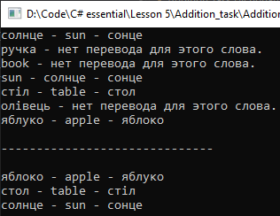

# Lesson5_addition_task
Условия задачки:
>Расширьте пример 5 (русско-английский словарь) еще и украинским словарем. 
 Реализуйте возможность поиска не только по ключевым русским словам и словам на остальных языках. 

Подытог: вот такенный майндфак на выходе
>
